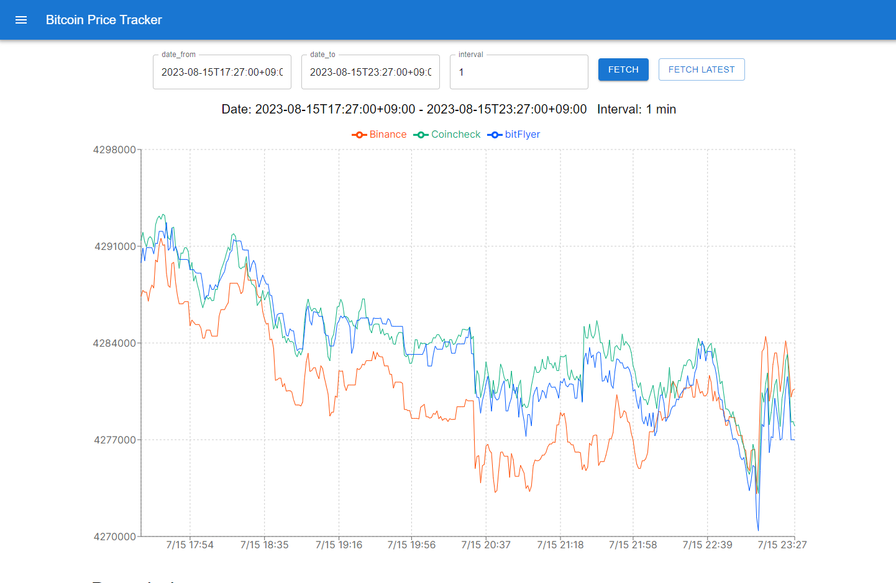
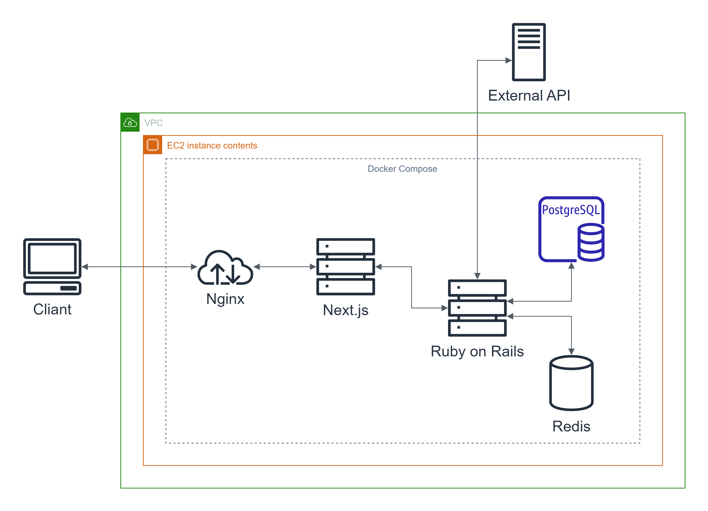

# Bitcoin Price Tracker
Bitcoinの1分間隔の価格変動をグラフで見ることができ、3つの取引所(Binance, Coincheck, bitFlyer)の1BTCあたりの日本円での価格を比較できます。 
それぞれの取引所のホームページでは自身の取引所の価格のグラフしかなく、またグラフの描画に必要な高頻度(1分間隔)の過去データを得るのは手間がかかります。そこでこのアプリケーションではデータの収集をサーバー側で行い、手間なく簡単に価格変動をグラフで確認できるようにしました。 
データの日時の範囲の指定および時間間隔の指定を行えるので、グラフの描画を行う際のデータを自由に選択できます。 
URL: [http://15.152.34.34/graph](http://15.152.34.34/graph)

# 環境等

- Ruby on Rails 7.0.6
  - Ruby 3.2.2
- Next.js 13.4.12
  - Typescript 5.1.6
  - React 18.2.0
- PostgreSQL 15.3
- Redis 7.0.12
- Nginx 1.25.1
- Docker
- AWS EC2

# 構成図

- Backend(Ruby on Rails)
  - 外部APIを呼び出してデータを取得し、DB(PostgreSQL)に保存します
  - 外部APIへの呼び出しは非同期処理(Sidekiq)を用いて１分毎に行います
  - Frontend(Nextjs)からのAPIの呼び出しに対してデータを返却します
- Frontend(Nextjs)
  - Cliantからリクエストがあった際に、グラフ描画のコードが含まれた静的ページを送信します
  - グラフ描画(Rechartsを用いる)に必要なデータをCliantに渡します。データはBackendのAPIを呼び出して取得しCliantにWeb APIを介して返却するので、Next.jsは中間APIとして機能します。
- Redis
  - 非同期処理を行うRubyのGemであるSidekiqに必要なため用いています

# Benchmark
1万件のDBのレコードを取り出して2つの方法(gRPC/protobu,HTTP/JSON)で受け取るのにかかる時間を計測します。1つ目の計測にはRubyのBenchmarkモジュールを用います。どちらのServer,ClientもRuby on Rails上で立ち上げました。単位はsecです。

|               | user     | system   | total    | real         |
| ------------- | -------- | -------- | -------- | ------------ |
| gRPC/protobuf | 0.002513 | 0.000000 | 0.002513 | (  0.255625) |
| HTTP/JSON     | 0.010337 | 0.000000 | 0.010337 | (  0.608013) |

userを比較すると約4倍程度高速になりました。
今度はClientをWebブラウザに変更して、同様に計測します。計測はChormeの開発者ツールを用いて5回の平均を取りました。
|               | Time     | Size   |
| ------------- | -------- | ------ |
| gRPC/protobuf | 305.2ms  | 640 kB |
| HTTP/JSON     | 647.2 ms | 931 kB |
この場合は2倍程度高速化し、サイズは0.7倍程度になりました。